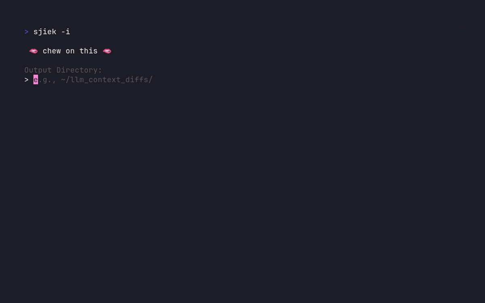

# sjiek 🪄

> _"🫦 chew on this 🫦"_

`sjiek` is a command-line tool designed to help you quickly generate `git diff` outputs of your current code changes. It saves these diffs to a file and can copy them to your clipboard, making it easy to provide context to Large Language Models (LLMs) or share your work-in-progress.

It features an optional interactive mode powered by [Charm Gum](https://github.com/charmbracelet/gum) for a user-friendly experience, but defaults to fast, non-interactive operation for quick use.

*(**sjiek** is Dutch/Flemish for "gum" and a homonym for the French "chic." It's pronounced "sheek" or /ʃik/.)*

## Demo



## Features

*   Generate git diffs for:
    *   All uncommitted changes (staged and unstaged).
    *   Only staged changes (what's ready for commit).
    *   Only unstaged changes (current work not yet staged).
*   Fast non-interactive default operation.
*   Optional user-friendly interactive mode using `gum` for selecting options on-the-fly.
*   Save diff output to a configurable directory and filename.
*   Optionally add a timestamp to filenames for easy versioning of diffs.
*   Optionally copy the diff content directly to the system clipboard.
*   Optional startup intro animation (because why not?).
*   Built as a single, portable binary with Go.

## Requirements

*   **Git:** sjiek operates on Git repositories and uses `git` commands.
*   **Gum (for interactive mode & intro):** [Charm Gum](https://github.com/charmbracelet/gum) must be installed and accessible in your system's PATH for the interactive (`-i`) mode and the startup intro (`--intro`) to function with their TUIs.
*   **Shell (`sh`):** Required by the interactive mode's `gum` integration for `gum choose` and `gum input`. This is standard on Linux and macOS.
*   **(Optional) Clipboard utility:** For the clipboard copy feature (`-c`) to work effectively, your operating system needs a clipboard utility that `github.com/atotto/clipboard` (the Go library used) can interface with.
    *   **Linux/X11:** `xclip` or `xsel` (e.g., `sudo apt install xclip`)
    *   **Linux/Wayland:** `wl-clipboard` (e.g., `sudo apt install wl-clipboard`)
    *   **macOS:** `pbcopy`/`pbpaste` (comes pre-installed)
    *   **Windows:** Should work out-of-the-box.

## Installation

### Using `go install` (Recommended)

(Replace `yourusername` with your actual GitHub username)
```bash
go install github.com/yourusername/sjiek@latest
```
This command will download the source code, compile it, and place the `sjiek` binary in your `$GOPATH/bin` directory (or `$HOME/go/bin` if GOPATH is not set). Ensure this directory is included in your system's PATH environment variable.

### Building from Source

1.  **Clone the repository:**
    (Replace `yourusername` with your actual GitHub username)
    ```bash
    git clone https://github.com/yourusername/sjiek.git
    cd sjiek
    ```
2.  **Build the binary:**
    (Consider using the `build_and_install.sh` script provided in the repository for convenience)
    ```bash
    go build -o sjiek .
    ```
    This creates an executable file named `sjiek` in the current directory.
3.  **Move the binary to a directory in your PATH:**
    For example, to `~/.local/bin`:
    ```bash
    mkdir -p ~/.local/bin
    mv sjiek ~/.local/bin/
    ```
    *(Ensure `~/.local/bin` is in your PATH.)*

## Usage

`sjiek` defaults to a fast, non-interactive mode using pre-set defaults. Use the `-i` flag for an interactive experience.

```
sjiek [flags]
```

### Flags

*   `-o <directory>`: Specifies the output directory for the diff file.
    *   Default: `~/llm_context_diffs` (or `./sjiek_diffs` if home is not accessible).
*   `-n <filename>`: Sets the filename for the diff file.
    *   Default: `current_diff.txt`.
*   `--diff-type <type>`: Determines the type of git diff to generate.
    *   Options:
        *   `all` (default): All uncommitted changes (staged & unstaged).
        *   `staged`: Only staged changes.
        *   `unstaged`: Only unstaged changes.
*   `-t`: Appends a timestamp (e.g., `_YYYYMMDD_HHMMSS`) to the filename.
*   `-c`: Copies the generated diff content to the system clipboard.
*   `-i`: Run in interactive mode using `gum` to select options.
*   `--intro`: Show the startup intro animation (requires `gum`).
*   `--help`: Displays this help message.

### Default (Non-Interactive) Mode

Running `sjiek` without any flags (or with specific operational flags like `-n`, `-o`, `-c`, `-t`, `--diff-type` but *without* `-i`) will execute immediately using default values or the flags provided.

```bash
# Fast diff with all defaults (all changes, to ~/llm_context_diffs/current_diff.txt)
sjiek

# Diff all changes, copy to clipboard, use default filename & output dir
sjiek -c

# Diff staged changes, specific filename, default output dir
sjiek --diff-type staged -n my_staged_changes.diff
```

### Interactive Mode

To use the interactive TUI for selecting options, use the `-i` flag:

```bash
sjiek -i
```
If you also want the startup intro with interactive mode:
```bash
sjiek -i --intro
```

In interactive mode, you will be guided by `gum` prompts to:
1.  Select the desired diff type.
2.  Enter the output directory.
3.  Enter the filename.
4.  Confirm timestamping.
5.  Confirm copying to clipboard.

### Examples

1.  **Quick default diff (all changes, default file/location):**
    ```bash
    sjiek
    ```

2.  **Run interactively for guided setup:**
    ```bash
    sjiek -i
    ```

3.  **Show intro then run interactively:**
    ```bash
    sjiek --intro 
    ```
    *(Note: If only `--intro` is provided, `sjiek` will run interactively after the intro.)*

4.  **Generate a diff of all changes, name it `latest_updates.diff`, copy to clipboard (non-interactive):**
    ```bash
    sjiek -n latest_updates.diff -c
    ```

5.  **Get only staged changes, save to a timestamped file in `~/project_diffs/` (non-interactive):**
    ```bash
    sjiek --diff-type staged -o "~/project_diffs/" -t
    ```

## Development

This project is built with Go.

*   Clone the repository.
*   Ensure Go (version 1.20 or newer is recommended) is installed.
*   Fetch dependencies: `go mod tidy`
*   Build: `go build -o sjiek .` (or use `./build_and_install.sh`)
*   Run tests (if any are added in the future): `go test ./...`

## License

This project is licensed under the MIT License. See the [LICENSE](LICENSE) file for details.
